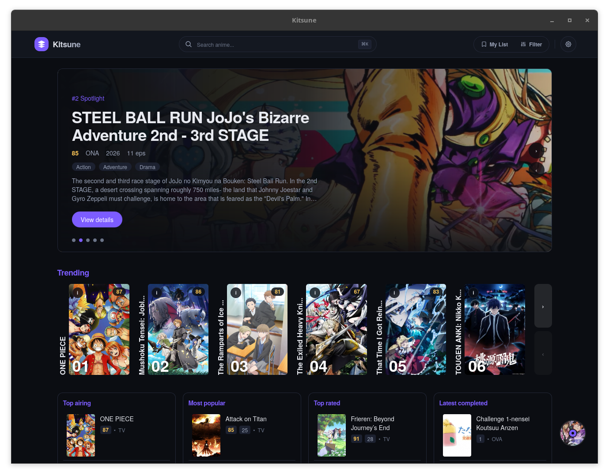
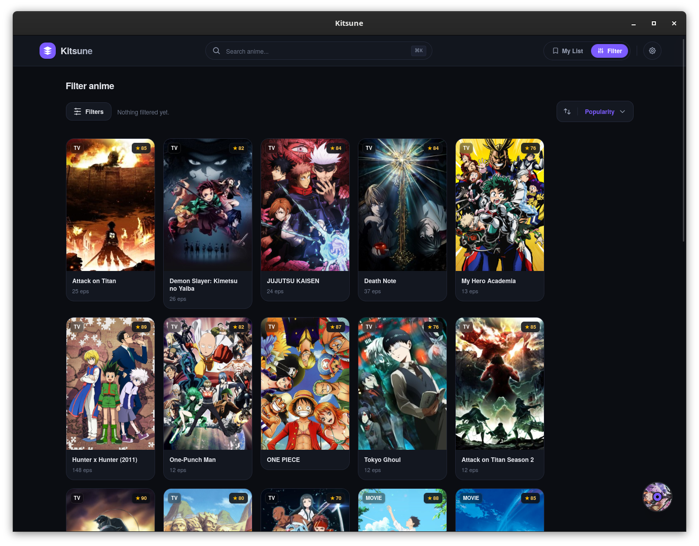
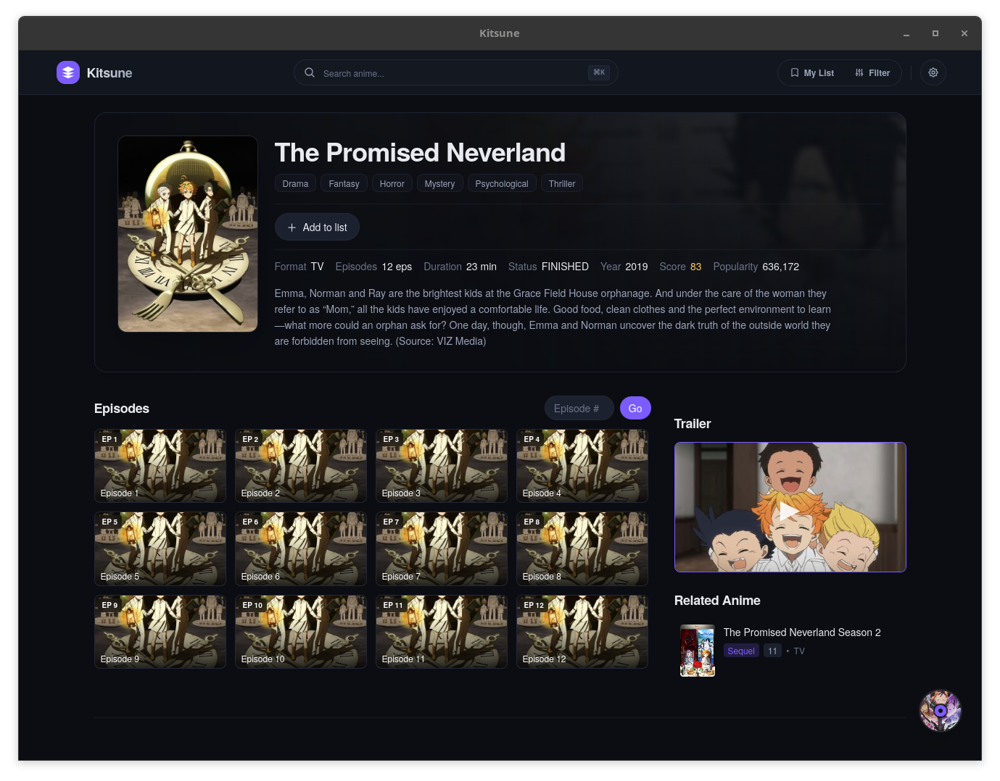
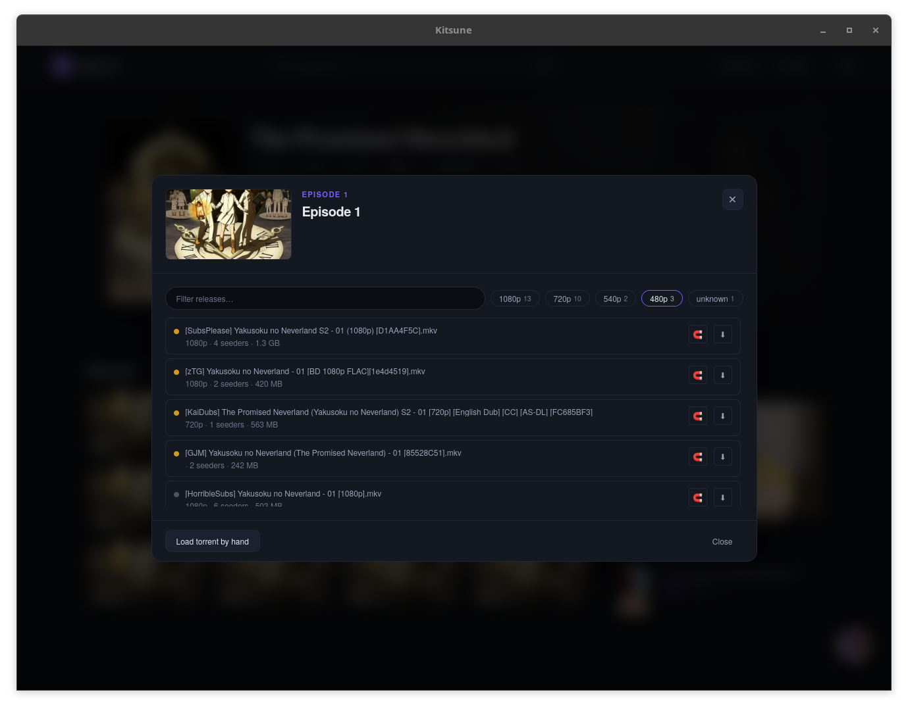
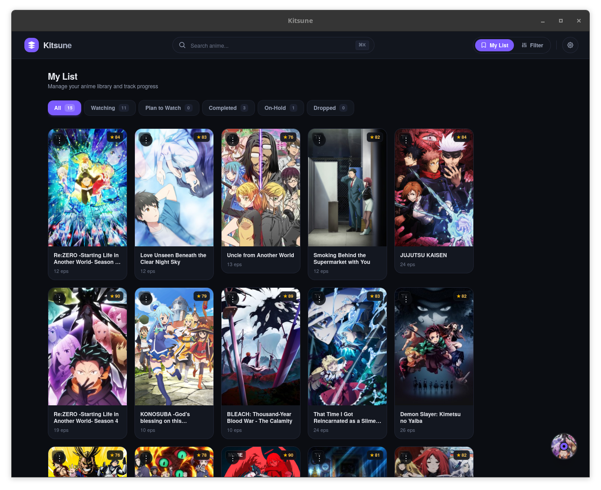
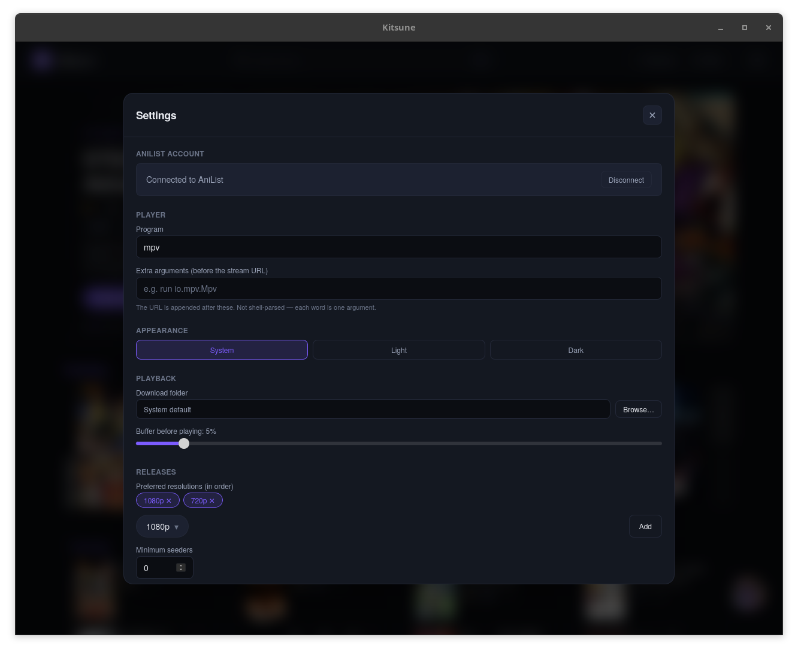

# Kitsune

A desktop anime streaming app. Kitsune browses and searches anime metadata
(powered by [AniList](https://anilist.co), with [Jikan](https://jikan.moe) for
episode lists), finds matching releases on [Nyaa](https://nyaa.si), and streams
them directly from torrents — without leaving the app.

Built with [Tauri 2](https://v2.tauri.app/) + [SvelteKit](https://svelte.dev/docs/kit)
+ [Svelte 5](https://svelte.dev/) + TypeScript, styled with
[Tailwind CSS 4](https://tailwindcss.com/).

## Install

Download the latest installer from the
[Releases page](https://github.com/AyoubToueti/Kitsune/releases/latest).

### Linux

Every release ships a portable AppImage, a Debian/Ubuntu `.deb`, and a
Fedora/openSUSE `.rpm`.

    # AppImage — runs on any distro
    chmod +x Kitsune_*_amd64.AppImage
    ./Kitsune_*_amd64.AppImage

    # Debian / Ubuntu
    sudo apt install ./kitsune_*_amd64.deb

    # Fedora / openSUSE
    sudo dnf install ./kitsune-*.x86_64.rpm

> The AppImage needs FUSE 2 to run. On newer distros where `libfuse2` is not
> installed, either install it (`libfuse2t64` on Ubuntu 24.04+) or run the
> AppImage with `--appimage-extract-and-run`.

Playback uses the system GStreamer stack, and the external-player handoff uses
`mpv`. Install them through your distro if they are missing.

### Windows

Run the `Kitsune_*_x64-setup.exe` (or the `.msi`) from the Releases page.
WebView2 is bundled with Windows 10 and later, so no extra runtime is needed.

## Features

- **Discovery** — trending rails, curated shelves, top charts, and a genre grid.
- **Browse & filter** — search with filters for genre, season, year, format,
  status, and streaming resolution.
- **Detail pages** — synopsis, metadata, related/recommended titles, trailer
  cards, and external streaming links.
- **Torrent streaming** — searches [Nyaa](https://nyaa.si) for releases, then
  ranks them with a pipeline ported from
  [Sonarr](https://github.com/Sonarr/Sonarr) before playing them through
  [librqbit](https://github.com/ikatson/rqbit) with stream-health monitoring.
- **Local library** — continue-watching, watch progress, resume, and a
  per-title list status (watching / completed / planned / …).
- **External player** — hand a stream off to a local player such as
  [mpv](https://mpv.io).
- **AniList sign-in** — OAuth via a `kitsune://` deep link, with the token
  persisted across restarts.

## Screenshots

Drop PNGs into `docs/screenshots/` using the filenames below and they will
render. Suggested width: 1280px (the default window size).

| Home | Browse & filter |
| :--: | :-------------: |
|  |  |

| Detail page | Watch |
| :---------: | :---: |
|  |  |

| List page | Settings |
| :-------: | :------: |
|  |  |

## Project structure

    src/                 SvelteKit frontend
      lib/               pure logic + Svelte components (each unit is tested)
      routes/            app routes: home, anime, filter, list, search, top, watch
      test/              Vitest setup and SvelteKit virtual-module stubs
    src-tauri/           Rust backend
      src/
        commands.rs      IPC surface exposed to the frontend
        providers/       AniList + Jikan metadata providers
        indexer/         torrent search: Nyaa transport + Sonarr-derived parsing/ranking
        torrent/         librqbit session management
        player/          playback + player state
        auth/            AniList token + deep-link handling
        settings/        persisted settings store
      tests/             `cargo test` integration tests (wiremock for HTTP)

## Getting started

### With Nix (recommended on NixOS)

The `flake.nix` dev shell provides the full Rust + Node toolchain and every
native dependency WebKitGTK and GStreamer need for playback.

```sh
nix develop
```

### Without Nix

Install the usual Tauri prerequisites for your platform (Rust, Node 22+, pnpm,
and the [Tauri system dependencies](https://v2.tauri.app/start/prerequisites/)),
then:

```sh
pnpm install
```

### Run in development

```sh
pnpm tauri dev
```

The frontend alone can be run with `pnpm dev` (Vite on port 1420), but most
features need the Rust backend.

### Build

```sh
pnpm tauri build
```

## Testing

Frontend (Vitest + Testing Library):

```sh
pnpm test          # run once
pnpm test:watch    # watch mode
```

Backend (Rust):

```sh
cd src-tauri && cargo test
```

Type-check the frontend:

```sh
pnpm check
```

## Releasing

The app version lives in four files: `src-tauri/tauri.conf.json` (the source of
truth), `package.json`, `src-tauri/Cargo.toml`, and the `kitsune` entry in
`src-tauri/Cargo.lock`. Keep them in lockstep with:

    pnpm version:sync 0.2.0     # set every file to 0.2.0
    pnpm version:sync           # or propagate tauri.conf.json's version

Then commit, tag, and push — the tag triggers the release workflow:

    git commit -am "release: v0.2.0"
    git tag v0.2.0
    git push origin main --tags

The tag **must** match the version (`tagName: v__VERSION__` is filled from
`tauri.conf.json`).

## Credits

Kitsune stands on the work of others:

- **Metadata** — [AniList](https://anilist.co) (GraphQL API) and
  [Jikan](https://jikan.moe) (episode lists).
- **Torrent index** — [Nyaa](https://nyaa.si) (`nyaa.si`) for release search.
- **Release parsing & ranking** — the title/episode parser, normalizer, and
  release-ranking pipeline in `src-tauri/src/indexer/` are ported from the
  [Sonarr](https://github.com/Sonarr/Sonarr) project (specifically its
  `Parser`/`AnimeParser` and quality-resolution logic), adapted to the shapes
  anime indexers emit and re-implemented in Rust.
- **Torrent engine** — [librqbit](https://github.com/ikatson/rqbit).
- **Playback** — WebKitGTK + GStreamer, with optional handoff to
  [mpv](https://mpv.io).

## Recommended IDE setup

[VS Code](https://code.visualstudio.com/) + [Svelte](https://marketplace.visualstudio.com/items?itemName=svelte.svelte-vscode) + [Tauri](https://marketplace.visualstudio.com/items?itemName=tauri-apps.tauri-vscode) + [rust-analyzer](https://marketplace.visualstudio.com/items?itemName=rust-lang.rust-analyzer).

## License

MIT